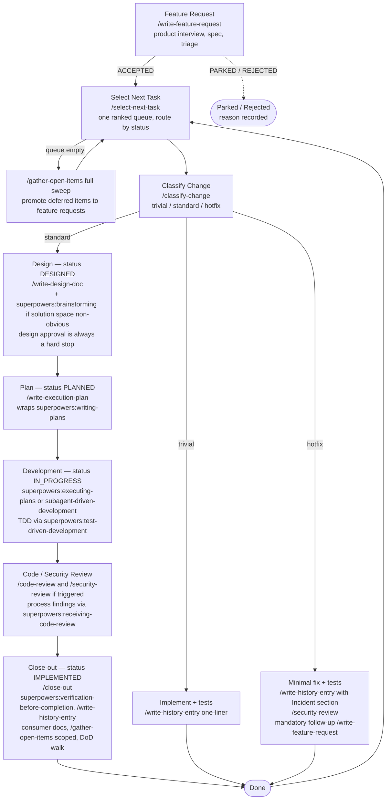

# SDLC Process Contract

Drop this file into a project (as `CLAUDE.md`, or referenced from it) to make Claude Code work through every change the same way. It is **stack-neutral** — pair it with a stack conventions doc (`CLAUDE.stack.md`; see `CLAUDE.stack.example.md` in the kit for a worked example).

Run `/setup-sdlc` once per project before using this process — it maps the repo, adapts the stack doc, records the autonomy policy below, and optionally bootstraps `docs/design/`.

---

## Lifecycle

```
Feature Request → Design → Plan → Development → Code/Security Review → Close-out
```



Every change also has a **tier**, decided by `/classify-change` before any code is written:

| Tier | Trigger | Pipeline |
|---|---|---|
| **trivial** | No behavior/schema/API/auth/dependency change; ≤2 files, ~20 lines | History one-liner + tests if behavior-adjacent. Nothing else. |
| **standard** | Any feature or behavior change | Full lifecycle. |
| **hotfix** | A shipped change is causing a live problem | Immediate minimal fix/revert + tests + history entry with an Incident section + a **mandatory** follow-up feature request. |

`/classify-change` is authoritative. Auth, data-access, API-surface, schema/migration, API-key, and dependency changes are **never trivial** regardless of size. When uncertain, the tier is `standard`. A trivial change that grows mid-implementation is stopped and re-classified.

---

## Autonomy Policy

`/setup-sdlc` writes this block. Skills read it to decide whether a gate is a hard stop or an auto-proceed. Hand-edit it any time.

```yaml
autonomy:
  task_selection: confirm        # confirm | auto
  product_brainstorm: discuss    # discuss | solo
  technical_brainstorm: solo     # discuss | solo
  implementation_checkpoints: pause  # pause | run-through
```

**Always a hard stop, regardless of policy:** design-doc approval, feature-request triage (accept/park/reject), code/security review findings.

When a gate auto-proceeds, the agent records the decision and any assumptions in the relevant doc and stays interruptible.

---

## Artifacts

| Phase | Artifact | Location | Produced by |
|---|---|---|---|
| Feature Request | Product spec | `docs/feat-req/<name>.md` | `/write-feature-request` |
| Design | Design doc | `docs/design/<name>.md` (matches feat-req name) | `/write-design-doc` |
| Plan | Execution plan | `docs/plans/<name>.md` | `/write-execution-plan` |
| Development | History entry | `docs/history/${timestamp}_<desc>.md` | `/write-history-entry` |
| Any decision with cross-feature or long-lived architectural consequence | ADR | `docs/decisions/${NNN}_<name>.md` | manual, format below |
| Close-out | Status flip + doc updates | — | `/close-out` |

`docs/design/architecture.md` and `docs/design/data-model.md` are living docs — updated in the same change whenever structure or schema moves. `docs/STATUS.md` is generated by `scripts/render-status.mjs` (never hand-edited).

---

## State

Every feature request carries a `status` in its frontmatter. This is the **single source of truth** — no filename prefixes. `select-next-task` and `render-status.mjs` rank on it.

| `status` | Set by | Meaning |
|---|---|---|
| `ACCEPTED` | `/write-feature-request` triage | Spec approved, in the queue |
| `PARKED` | `/write-feature-request` triage / open-items sweep | Valid, not now — reason recorded, invisible to `select-next-task` |
| `REJECTED` | `/write-feature-request` triage | Not doing it — reason recorded, kept for the record |
| `DESIGNED` | `/write-design-doc` (on approval) | Design doc `APPROVED`, ready to plan |
| `PLANNED` | `/write-execution-plan` | Plan exists and is stamped |
| `IN_PROGRESS` | Development phase entry | Being built |
| `IMPLEMENTED` | `/close-out` | Definition of Done satisfied |

Design docs carry their own `status: DRAFT | APPROVED`. Plans carry `status: PLANNED | IN_PROGRESS | IMPLEMENTED` plus `feat_req:` and `design:` links.

---

## Definition of Done

A **standard**-tier task is complete only when every item holds. `/close-out` walks this list explicitly in its output.

- [ ] Design doc in `docs/design/` describing the change
- [ ] Execution plan in `docs/plans/`, all steps checked
- [ ] `architecture.md` / `data-model.md` updated if structure or schema changed
- [ ] README (and any consumer-facing docs / API descriptions) updated, or "no consumer-facing impact" recorded
- [ ] Tests written/updated for new/changed behavior (TDD during Development)
- [ ] All existing tests pass — verified via `superpowers:verification-before-completion` with recorded evidence
- [ ] `/code-review` run, findings addressed or rationale recorded
- [ ] If any Security Review trigger applied (auth, new external endpoint, data-access control, API-key logic): `/security-review` run and findings documented. Otherwise the design doc states "no security-relevant changes."
- [ ] History entry in `docs/history/` (Deviations / Discoveries / Decisions / Step status / Verification; `## Per-Repo Summary` for multi-repo)
- [ ] A merged PR in every repo in the plan's `## Repositories`; links in `## Pull Requests`; merge order per the design doc's `### Merge order` — verified live via `gh` (multi-repo efforts)
- [ ] Design doc `## Open Items` section populated; scoped open-items reconciliation run
- [ ] `status: IMPLEMENTED` on the feature request

**trivial**: history one-liner (tier + justification + files touched) + passing tests. **hotfix**: fix + tests + history entry with Incident section + follow-up feature request filed.

---

## Open Items

After every standard feature, the design doc ends with:

```
## Open Items
- [ ] ...
```

`None` only if genuinely zero. `/close-out` runs a scoped reconciliation over these: an item is **promoted to a feature request now** if it is (i) a known correctness or security gap, (ii) blocks a stated near-term feature, or (iii) small and well-understood enough that filing costs less than re-deriving later. Otherwise it stays deferred with a one-line rationale. `/gather-open-items` re-evaluates deferred items in its full-sweep mode (run on demand, or automatically when `select-next-task` finds an empty queue).

---

## Style Guide

If the project has `docs/design/STYLE_GUIDE.md`, every UI or user-facing-output change must conform to it, and `/code-review` verifies UI diffs against it. The design doc records UI/UX changes and cites the relevant style-guide sections. Update the style guide (with the user's agreement) when a change establishes a new pattern. See `STYLE_GUIDE.template.md` in the kit.

---

## Architecture Decision Records

Create an ADR in `docs/decisions/` (`${NNN}_decision-name.md`) when a decision has **cross-feature or long-lived architectural consequence** — something a developer working on an unrelated part of the system would need to know:

- Choosing between two or more meaningful technical approaches with lasting effect
- Deviating from an existing pattern in the codebase
- Adding or removing a dependency

Feature-local tradeoffs ("which of these three ways to build X") belong in the design doc's **Alternatives Considered** section, not a separate ADR. When a design doc's alternative rises to ADR level, write the ADR and link it from that section.

```markdown
# [Decision title]

## Status
Accepted | Superseded by [link]

## Context
What problem or question forced this decision?

## Options Considered
- **Option A** — description, pros/cons
- **Option B** — description, pros/cons

## Decision
What was chosen and why.

## Consequences
Trade-offs accepted. Known limitations. Follow-up decisions this creates.
```

---

## Layer & module rules

Stack-specific — see `CLAUDE.stack.md`.
