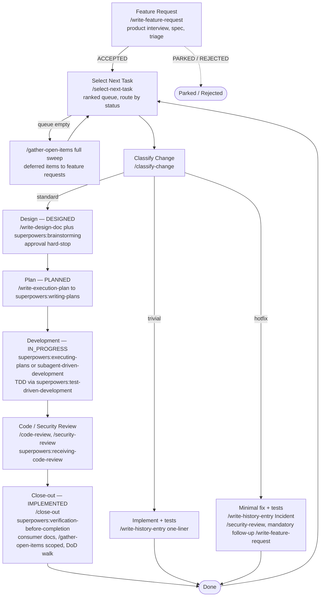

# sdlskills

A reusable **agentic SDLC kit** for Claude Code: an opinionated, artifact-driven development process plus the skills that implement each phase.

## The idea

The skills exist to serve a **process**, not the other way around. Drop the process contract into a project and Claude Code works through every change the same way:



Each phase produces a required artifact in a fixed location, so a project's history stays legible — you can tell *why* a change happened, not just *what* changed. Nothing is "done" until the Definition of Done is satisfied.

Two things keep it practical:

- **Three tiers.** `classify-change` sorts every change into *trivial* (history one-liner + tests), *standard* (full pipeline), or *hotfix* (fast lane + mandatory follow-up). The paper trail is proportional to the risk.
- **An autonomy policy.** `setup-sdlc` interviews you once about which gates should stop for your review and which should auto-proceed. Design approval, feature-request triage, and review findings are always hard stops; everything else is configurable.

## Layout

| Path | Role |
|---|---|
| [`CLAUDE.process.md`](CLAUDE.process.md) | The stack-neutral process contract — lifecycle, tiers, state model, Definition of Done, ADR format, autonomy policy. **This is the deliverable.** |
| [`CLAUDE.stack.example.md`](CLAUDE.stack.example.md) | Worked example of the stack-conventions half (NestJS/Prisma/React). Adopters replace it. |
| [`skills/`](skills/) | The nine phase skills. |
| [`scripts/render-status.mjs`](scripts/render-status.mjs) | Derives `docs/STATUS.md` from feature-request frontmatter. Wired to a `Stop` hook. |
| [`examples/react-components/`](examples/react-components/) | Optional React admin-console conventions skill. |
| [`docs/design/STYLE_GUIDE.template.md`](docs/design/STYLE_GUIDE.template.md) | Starting point for a project style guide. |
| [`docs/kit-open-items.md`](docs/kit-open-items.md) | Unresolved design questions about the kit itself. |

## Skills

| Skill | Phase |
|---|---|
| `setup-sdlc` | One-time adoption: map repo, adapt stack doc, autonomy interview, optional `docs/design/` bootstrap |
| `write-feature-request` | Feature Request — product interview → spec → triage (accept/park/reject) |
| `classify-change` | Tier decision (trivial / standard / hotfix) before any code |
| `write-design-doc` | Design — fixed-structure design doc, conditional technical brainstorm, hard-stop approval |
| `write-execution-plan` | Plan — wraps `superpowers:writing-plans`, enforces location + frontmatter + state |
| `write-history-entry` | Development — intent-vs-reality execution trace |
| `select-next-task` | Picks the next task from one unified ranked queue, routes it to the right phase |
| `gather-open-items` | Reconciles Open Items — scoped (at close-out) and full-sweep (empty queue / on demand) |
| `close-out` | Definition-of-Done walk, consumer-doc updates, Open Items reconciliation, status flip |

External: `superpowers` plugin (`writing-plans`, `brainstorming`, `executing-plans`, `subagent-driven-development`, `receiving-code-review`, `verification-before-completion`), plus built-in `/code-review` and `/security-review`.

## Using it in a project

1. Install the `superpowers` plugin:
   ```
   /plugin marketplace add claude-plugins-official
   /plugin install superpowers@claude-plugins-official
   ```
2. Copy `CLAUDE.process.md` into the target repo; reference it from the project `CLAUDE.md`. Create a `CLAUDE.stack.md` from `CLAUDE.stack.example.md`.
3. Symlink the skills and copy the script:
   ```bash
   mkdir -p .claude/skills scripts
   for s in setup-sdlc write-feature-request classify-change write-design-doc \
            write-execution-plan write-history-entry select-next-task \
            gather-open-items close-out; do
     ln -s /path/to/sdlskills/skills/$s .claude/skills/$s
   done
   cp /path/to/sdlskills/scripts/render-status.mjs scripts/
   ```
4. Run `/setup-sdlc` and follow the interview.
5. Start the loop: `/write-feature-request`, then `/select-next-task`.

## Non-goals

No application code. Process + tooling only, layered onto whatever codebase adopts it. Multi-agent / parallel execution is out of scope for now — see [`docs/kit-open-items.md`](docs/kit-open-items.md).
